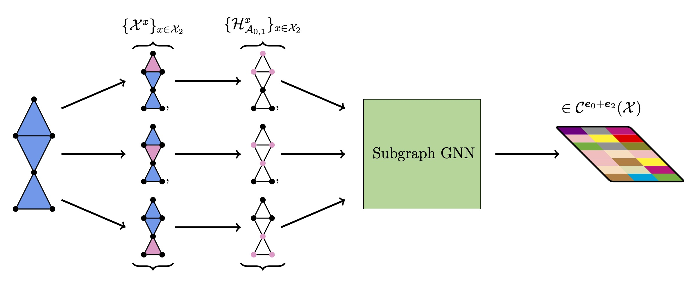

# Scalable Multi-Cellular Networks
This repository contains the code for the paper [Topological Blindspots: Understanding and Extending Topological Deep Learning Through the Lens of Expressivity](https://arxiv.org/abs/2408.05486) **(ICLR 2025 Oral)**, which introduces Scalable Multi-Cellular Networks (SMCN).

<p align="center">
  
</p>

## Installation

To install dependencies, run

```bash
pip install -r requirements.txt
```

## Usage

To run an experiment, use

```bash
python <experiment_name>/<experiment_name>.py
```

Each experiment has its own `model.py` file containing the model construction and a `config.yaml` file with the default hyperparameters used in the paper. You can override any config parameter via command line arguments, for example:

```bash
python experiments/zinc/zinc.py device=cpu batch_size=64
```

## Structure

- `data/`: Data types and preprocessing
- `experiments/`: Model construction and training for each experiment
- `models/`: Layers and model building blocks
- `utils/`: Training and evaluation utilities

## Citation

```bibtex
@article{eitan2024topological,
  title={Topological Blindspots: Understanding and Extending Topological Deep Learning Through the Lens of Expressivity},
  author={Eitan, Yam and Gelberg, Yoav and Bar-Shalom, Guy and Frasca, Fabrizio and Bronstein, Michael and Maron, Haggai},
  journal={arXiv preprint arXiv:2408.05486},
  year={2024}
}
```